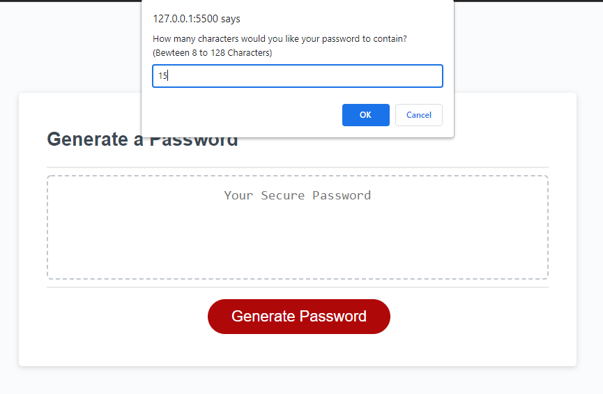
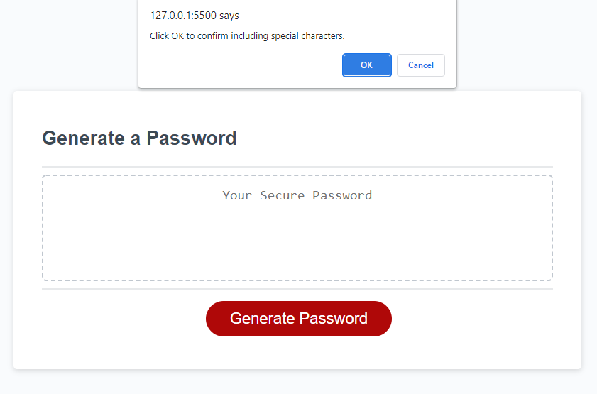
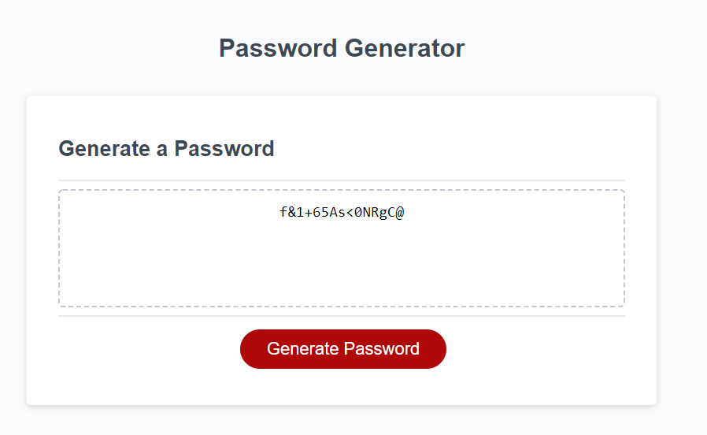

# password-generator

To create application to generate random passwords based on criteria selected.

## User Story

```
AS AN employee with access to sensitive data
I WANT to randomly generate a password that meets certain criteria
SO THAT I can create a strong password that provides greater security
```

## Acceptance Criteria

```
GIVEN I need a new, secure password
WHEN I click the button to generate a password
THEN I am presented with a series of prompts for password criteria
WHEN prompted for password criteria
THEN I select which criteria to include in the password
WHEN prompted for the length of the password
THEN I choose a length of at least 8 characters and no more than 128 characters
WHEN asked for character types to include in the password
THEN I confirm whether or not to include lowercase, uppercase, numeric, and/or special characters
WHEN I answer each prompt
THEN my input should be validated and at least one character type should be selected
WHEN all prompts are answered
THEN a password is generated that matches the selected criteria
WHEN the password is generated
THEN the password is either displayed in an alert or written to the page
```
## Getting started

- Create repository,  clone to work locally
- Create assets, copy of html/css/js starter codes

## Writing the script
- Identify Criteria = length/special characters/numeric characters/lower case characters/upper case characters
- Created variables for all options and a password pool

## Inside the function (generate password)
- Prompts created, requesting password length
- Confirm created for special characters,numbers,lowercase characters and uppercase characters.
- If confirmed, add set of array defined prior, to the password pool.
- Added alert if there is no characters chosen.
- Randomiser added, selects random from the password pool which does not exceed the characters the user chose during the first prompt.
- Return the random password

## Function write password
- Changes the text of password inside the textbox to be the password generated by the function "generatePassword"
- Event listener there to initialise the function "writePassword" when button is clicked

## Edits
- Tested different criteria for character types and length to see if everything matches and work as intended
- Added exit function so that the function doesn't continue even if the criteria isn't met (password length/minimum 1 character type)

## Final Product







- http://jpjp2328.github.io/password-generator


